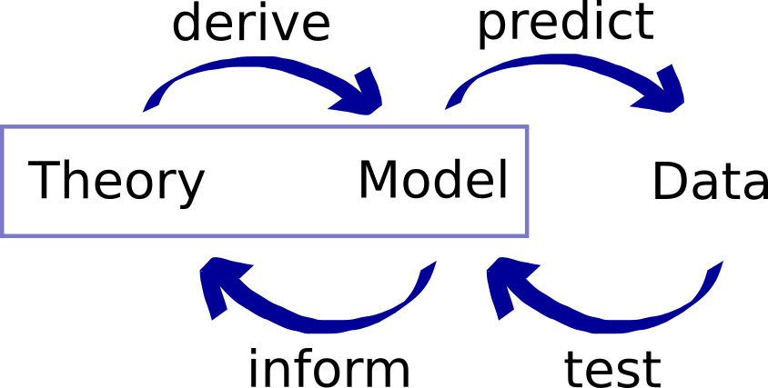
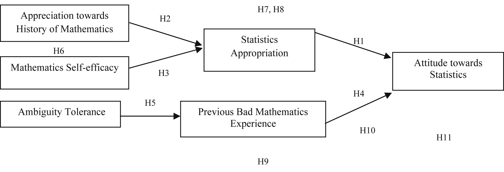
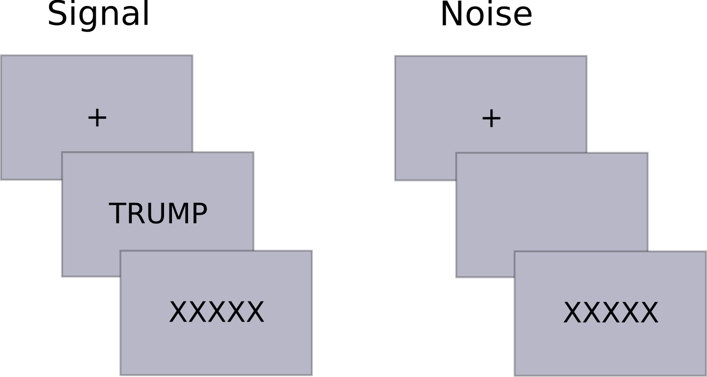
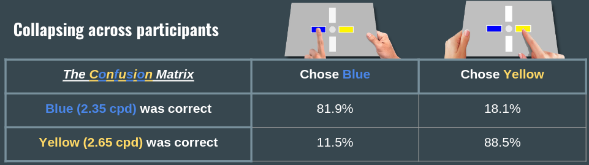
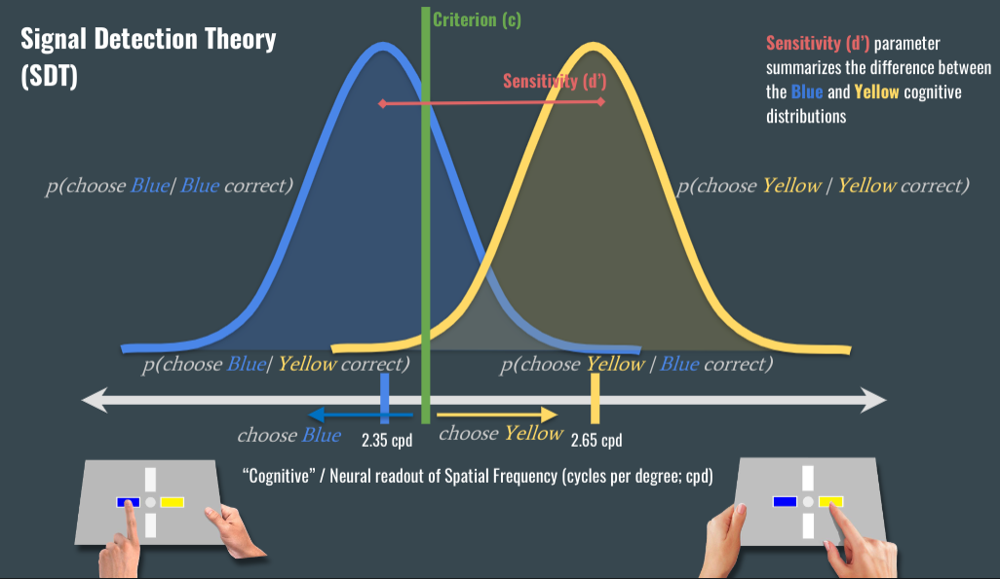

```{r,echo=F,eval=T,warning=F,message=F}
knitr::opts_chunk$set(echo = FALSE,message=FALSE, warning=FALSE)
library(diagram)
library('retimes')
library(mvtnorm)
library(tmvtnorm)
library(msm)
library(curl)
library(MCMCpack)
library("spatialfil")
library("ggplot2")
library("papaja")
library("shape")
library("cowplot")
library("gridExtra")
library("plyr")
library("dplyr")
library("psych")
library("RColorBrewer")
library("devtools")
library("readxl")
library("reshape2")
library(BayesFactor)
library("knitr")
library(kableExtra)
library("plotrix")
library("colorspace")
library(corrplot)
library(rstan)
library(brms)
rstan_options(auto_write = TRUE)
set.seed=123

myCols <- brewer.pal(8, "Dark2")

make.line <- function(x, mu = 0, s2 = 1, ...){
  y <- dnorm(x, mu, sqrt(s2))
  lines(x = rep(x, 2), y = c(0, y) , ...)
}

make.poly <- function(a, b, mu = 0, s2 = 1, seq.by = .01, ...){
  y <- dnorm(seq(a, b, seq.by), mu, sqrt(s2))
  xx <- c(seq(a, b, seq.by), seq(b, a, -seq.by))
  yy <- c(y, rep(0, length(y)))
  polygon(xx, yy, border = NA, ...)
}

```

## A brief introduction to cognitive modeling

1. What kind of models are we talking about?
2. Signal detection
3. Application to perceptual decision making experiment

```{r}
# See https://github.com/mdnunez/encodingN200 for more information about the data
filename <- curl("https://raw.githubusercontent.com/jstbcs/ESCOP2022-WS/main/Data/pdmdata.csv")
pdm <- read.csv(filename)

pdm$spfn <- 1 - (as.numeric(as.factor(pdm$spf)) - 1)
pdm$response <- ifelse(pdm$accuracy==1, pdm$spfn, 1 - pdm$spfn)
```

## Theory, models, and data

\vskip5mm

\centering
{width=300px}

## Verbal vs. mathematical models

There are many things that people call models.

E.g. Prayoga, T., & Abraham, J. (2017). A psychological model explaining why we love or hate statistics.


\centering
{width=350px}

## Verbal vs. mathematical models

"A mathematical model or theory is a set of mathematical structures, including a set of *linkage statements*" van Zandt \& Townsend (2012).

- Behavioral variables are related to components of psychological processes using equations.
- Psychological processes are expressed as parameters and functions.
- Behavior needs to be quantifiable (e.g. accuracy, response time).

# Signal Detection Models

## Signal detection experiment

\centering
{width=200px}

| Stimulus | Present response | Absent Response | Total | 
|:------|:-----:|:---------:|:------:| 
|   Signal  |  75  |    25   |    100  | 
|  Noise  |  30 |   20   |   50  | 
|  Total  |  105 |   45   |     | 

## Signal detection experiment

\centering
{width=200px}

| Stimulus | Present response | Absent Response | Total | 
|:------|:-----:|:---------:|:------:| 
|   Signal  |  75 (Hits)  |    25 (Misses)   |    100  | 
|  Noise  |  30 (False Alarms) |   20 (Correct Rejections)   |   50  | 
|  Total  |  105 |   45   |     | 


## Signal Detection Models

- General idea: Perception strength $S$ varies gradually.
- On average, perceptual strength is higher when the stimulus is present/matches/old, etc.
- $$
S \sim
\begin{cases}
\mbox{Normal}(\mu = d', \sigma^2 = 1), \qquad \text{for signal-present trials,}\\
\mbox{Normal}(\mu = 0, \sigma^2 = 1), \qquad \text{for signal-absent trials.}
\end{cases}
$$

## Signal Detection Model

```{r echo = F, fig.asp = .6, fig.width=10}
par(mar = c(3,3,3,1), mgp = c(2,.7,0), cex = 1.5)
x <- seq(-3, 5, .01)
y.noise <- dnorm(x)
y.signal <- dnorm(x, 1.5)

plot(x, y.noise
     , type = "l", lwd = 4
     , xlim = range(x)
     , frame.plot = F
     , ylab = "Density"
     , xlab = "Sensory Strength"
     , cex.lab = 1.3
     )
lines(x, y.signal, col = "firebrick4", lwd = 4)
# make.line(0)
# make.line(1.5, 1.5)
# abline(v = 1, lwd = 2, col = "darkgreen")
# axis(3, at = c(0, 1.5), labels = c("", ""))
# mtext("d'", 3, line = .5, at = .75, cex = 1.3)
# text(1.2, .03, "c", cex = 1.3)
text(-2, .35, "Stimulus absent", cex = 1.3)
text(3.5, .35, "Stimulus present", cex = 1.3)
```

## SDT model

```{r echo = F, fig.asp = .6, fig.width=10}
par(mar = c(3,3,3,1), mgp = c(2,.7,0), cex = 1.5)
x <- seq(-3, 5, .01)
y.noise <- dnorm(x)
y.signal <- dnorm(x, 1.5)

plot(x, y.noise
     , type = "l", lwd = 4
     , xlim = range(x)
     , frame.plot = F
     , ylab = "Density"
     , xlab = "Sensory Strength"
     , cex.lab = 1.3
     )
lines(x, y.signal, col = "firebrick4", lwd = 4)
# make.line(0)
# make.line(1.5, 1.5)
# abline(v = 1, lwd = 2, col = "darkgreen")
axis(3, at = c(0, 1.5), labels = c("", ""), lwd = 3)
mtext("d'", 3, line = .5, at = .75, cex = 2)
# text(1.2, .03, "c", cex = 1.3)
text(-2, .35, "Stimulus absent", cex = 1.3)
text(3.5, .35, "Stimulus present", cex = 1.3)
```

$d' =$ Sensitivity.

## SDT model

```{r echo = F, fig.asp = .6, fig.width=10}
par(mar = c(3,3,3,1), mgp = c(2,.7,0), cex = 1.5)
x <- seq(-3, 5, .01)
y.noise <- dnorm(x)
y.signal <- dnorm(x, 1.5)

plot(x, y.noise
     , type = "l", lwd = 4
     , xlim = range(x)
     , frame.plot = F
     , ylab = "Density"
     , xlab = "Sensory Strength"
     , cex.lab = 1.3
     )
lines(x, y.signal, col = "firebrick4", lwd = 4)
abline(v = 1, lwd = 2, col = "darkgreen")
axis(3, at = c(0, 1.5), labels = c("", ""), lwd = 3)
mtext("d'", 3, line = .5, at = .75, cex = 2)
text(1.2, .03, "c", cex = 1.3)
text(-2, .35, "Stimulus absent", cex = 1.3)
text(3.5, .35, "Stimulus present", cex = 1.3)
```

$c =$ Criterion, determines the response made.

## SDT model predictions for H, M, F, C

What corresponds to the probability of hit?

```{r echo = F, fig.asp = .6, fig.width=9}
par(mar = c(3,3,3,1), mgp = c(2,.7,0), cex = 1.5)
x <- seq(-3, 5, .01)
y.noise <- dnorm(x)
y.signal <- dnorm(x, 1.5)

plot(x, y.noise
     , type = "l", lwd = 4
     , xlim = range(x)
     , frame.plot = F
     , ylab = "Density"
     , xlab = "Sensory Strength"
     , cex.lab = 1.3
     )
lines(x, y.signal, col = "firebrick4", lwd = 4)
abline(v = 1, lwd = 4, col = "darkgreen")
text(-2, .35, "Stimulus absent", cex = 1.3)
text(3.5, .35, "Stimulus present", cex = 1.3)
# make.poly(1, 5, mu = 1.5, col = adjustcolor("firebrick", .3))
```

## SDT model predictions for H, M, F, C

What corresponds to the probability of hit?

```{r echo = F, fig.asp = .6, fig.width=9}
par(mar = c(3,3,3,1), mgp = c(2,.7,0), cex = 1.5)
x <- seq(-3, 5, .01)
y.noise <- dnorm(x)
y.signal <- dnorm(x, 1.5)

plot(x, y.noise
     , type = "l", lwd = 4
     , xlim = range(x)
     , frame.plot = F
     , ylab = "Density"
     , xlab = "Sensory Strength"
     , cex.lab = 1.3
     )
lines(x, y.signal, col = "firebrick4", lwd = 4)
abline(v = 1, lwd = 4, col = "darkgreen")
text(-2, .35, "Stimulus absent", cex = 1.2)
text(3.5, .35, "Stimulus present", cex = 1.2)
make.poly(1, 5, mu = 1.5, col = adjustcolor("firebrick", .3))
```

Area under the curve!

## SDT model predictions for H, M, F, C

What corresponds to the probability of miss?

```{r echo = F, fig.asp = .6, fig.width=9}
par(mar = c(3,3,3,1), mgp = c(2,.7,0), cex = 1.5)
x <- seq(-3, 5, .01)
y.noise <- dnorm(x)
y.signal <- dnorm(x, 1.5)

plot(x, y.noise
     , type = "l", lwd = 4
     , xlim = range(x)
     , frame.plot = F
     , ylab = "Density"
     , xlab = "Sensory Strength"
     , cex.lab = 1.3
     )
lines(x, y.signal, col = "firebrick4", lwd = 4)
abline(v = 1, lwd = 4, col = "darkgreen")
text(-2, .35, "Stimulus absent", cex = 1.2)
text(3.5, .35, "Stimulus present", cex = 1.2)
make.poly(-3, 1, mu = 1.5, col = adjustcolor("firebrick", .3))
```

## SDT model predictions for H, M, F, C

What corresponds to the probability of false alarm?

```{r echo = F, fig.asp = .6, fig.width=9}
par(mar = c(3,3,3,1), mgp = c(2,.7,0), cex = 1.5)
x <- seq(-3, 5, .01)
y.noise <- dnorm(x)
y.signal <- dnorm(x, 1.5)

plot(x, y.noise
     , type = "l", lwd = 4
     , xlim = range(x)
     , frame.plot = F
     , ylab = "Density"
     , xlab = "Sensory Strength"
     , cex.lab = 1.3
     )
lines(x, y.signal, col = "firebrick4", lwd = 4)
abline(v = 1, lwd = 4, col = "darkgreen")
text(-2, .35, "Stimulus absent", cex = 1.2)
text(3.5, .35, "Stimulus present", cex = 1.2)
make.poly(1, 5, mu = 0, col = adjustcolor(1, .3))
```

## SDT model predictions for H, M, F, C

What corresponds to the probability of correct rejection?

```{r echo = F, fig.asp = .6, fig.width=9}
par(mar = c(3,3,3,1), mgp = c(2,.7,0), cex = 1.5)
x <- seq(-3, 5, .01)
y.noise <- dnorm(x)
y.signal <- dnorm(x, 1.5)

plot(x, y.noise
     , type = "l", lwd = 4
     , xlim = range(x)
     , frame.plot = F
     , ylab = "Density"
     , xlab = "Sensory Strength"
     , cex.lab = 1.3
     )
lines(x, y.signal, col = "firebrick4", lwd = 4)
abline(v = 1, lwd = 4, col = "darkgreen")
text(-2, .35, "Stimulus absent", cex = 1.2)
text(3.5, .35, "Stimulus present", cex = 1.2)
make.poly(-3, 1, mu = 0, col = adjustcolor(1, .3))
```

## Application to perceptual decision making experiment

\centering
{width=400px}

## Application to perceptual decision making experiment

```{r echo = F, fig.asp = .6, fig.width=9}
par(mar = c(3,3,3,1), mgp = c(2,.7,0), cex = 1.5)
x <- seq(-3, 5, .01)
y.noise <- dnorm(x)
y.signal <- dnorm(x, 1.5)

plot(x, y.noise
     , type = "l", lwd = 4
     , xlim = range(x)
     , frame.plot = F
     , ylab = "Density"
     , xlab = "Cognitive representation of spacial frequency"
     , cex.lab = 1.3
     , col = "darkblue"
     )
lines(x, y.signal, col = "darkgoldenrod1", lwd = 4)
abline(v = 1, lwd = 4, col = "palegreen4")
# make.poly(1, 5, mu = 1.5, col = adjustcolor("firebrick", .3))
```

## Application to perceptual decision making experiment

\centering
{width=450px}

## Signal Detection Model in brms

- Data are a coin flip and we model the probability: $Y_i \sim \mbox{Bernoulli}(p_i).$
- Probabilities are transformed to the continuous latent space: $p_i = \Phi(\mu_i).$
- In that space, we can use a linear model just as before: $\mu_i = \beta_0 + \beta_1 \mbox{spf}_i,$
- where $\beta_0$, the intercept, translates to the criterion,
- and $\beta_1$, the slope, translates to $d'$.

```{r echo = F, out.width="50%"}
par(mar = c(3,3,3,1), mgp = c(2,.7,0), cex = 1.5)
x <- seq(-3, 5, .01)
y.noise <- dnorm(x)
y.signal <- dnorm(x, 1.5)

plot(x, y.noise
     , type = "l", lwd = 4
     , xlim = range(x)
     , frame.plot = F
     , ylab = ""
     , xlab = "Latent frequency"
     , cex.lab = 1.3
     , col = "darkblue"
     )
lines(x, y.signal, col = "darkgoldenrod1", lwd = 4)
abline(v = 1, lwd = 4, col = "palegreen4")
# make.poly(1, 5, mu = 1.5, col = adjustcolor("firebrick", .3))
```

## Signal Detection Model in brms

\[Y_i \sim \mbox{Bernoulli}(p_i),\]
\[p_i = \Phi(\mu_i), \]
\[\mu_i = \beta_0 + \beta_1 \mbox{spf}_i.\]

\vskip10mm

```{r echo = T, results='hide', message=FALSE, cache = T}
fit1 <- brm(response ~ 1 + factor(spf),
           family = bernoulli(link="probit"),
           data = pdm[pdm$subject==1,])
```

## Signal Detection Model in brms

Computing *responses* using accuracy and presented spacial frequency:

```{r echo = T, eval = F}
pdm$spfn <- 1 - (as.numeric(as.factor(pdm$spf)) - 1)
pdm$response <- ifelse(pdm$accuracy==1
                       , pdm$spfn
                       , 1 - pdm$spfn)
```


## Signal Detection Model in brms

\Fontvi

```{r echo = T}
summary(fit1)
```

## Questions?

\vskip5mm

\centering
{width=250px}
